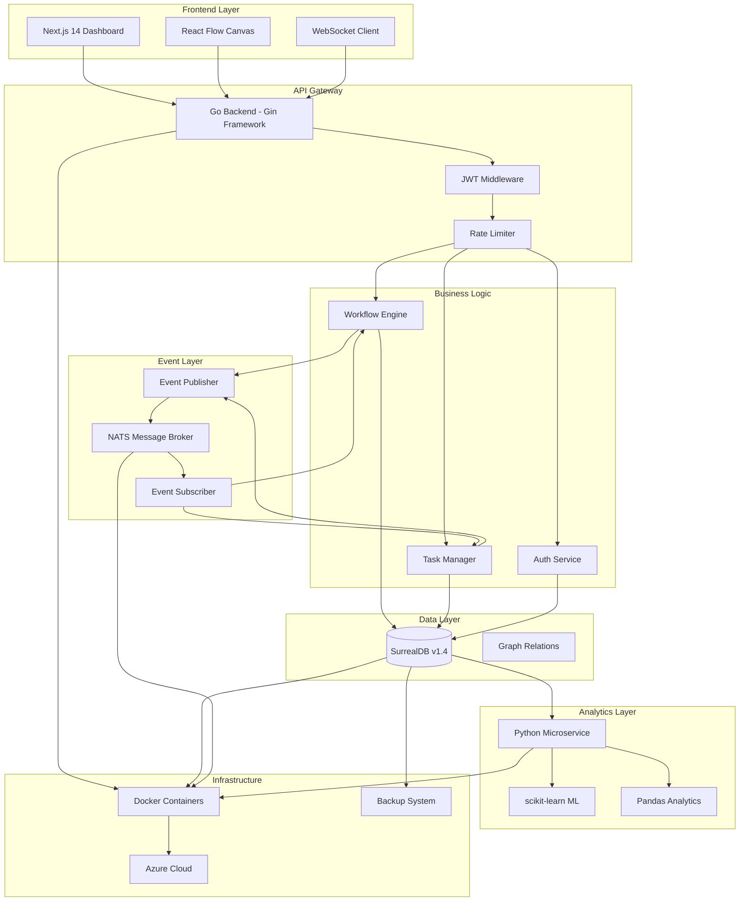
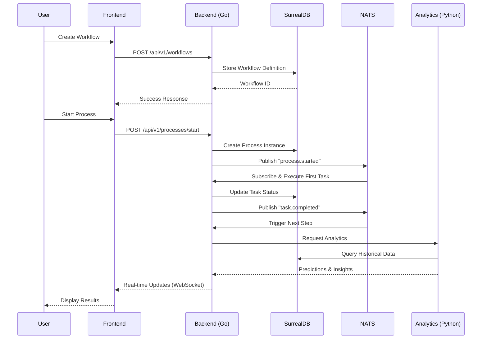

# 🚀 AgileOS - Enterprise BPM & Workflow Automation Platform

<div align="center">


[](https://golang.org/)
[](https://nextjs.org/)
[](https://surrealdb.com/)
[](https://www.docker.com/)
[](https://azure.microsoft.com/)

**A production-ready Business Process Management system with Event-Driven Architecture, AI-powered Analytics, and Enterprise-grade Security**

[🎯 Features](#-key-features) • [🏗️ Architecture](#-architecture) • [🚀 Quick Start](#-quick-start) • [📚 Documentation](#-documentation) • [🌐 Internationalization](#-internationalization)

</div>

---

## 📖 Overview

**AgileOS** is a comprehensive Enterprise Resource Planning (ERP) and Business Process Management (BPM) platform designed for modern organizations. Built with cutting-edge technologies and cloud-native architecture, it provides:

- **Visual Workflow Designer** - Drag-and-drop interface for creating complex business processes
- **Event-Driven Orchestration** - Real-time task execution with NATS message broker
- **AI-Powered Analytics** - Machine learning predictions for task completion times
- **Enterprise Security** - JWT authentication, rate limiting, digital signatures, and audit trails
- **Global Ready** - Multi-language support (Indonesian, English, Mandarin/中文)
- **Cloud Native** - Containerized deployment on Azure with Docker

### 🎯 Perfect For

- **Government Agencies** - E-governance compliance with immutable audit trails
- **Enterprises** - Workflow automation and process optimization
- **Startups** - Scalable BPM solution with modern tech stack
- **Educational Institutions** - Document approval and administrative workflows

---

## 🌟 Key Features

### 🧠 The Brain: BPM Engine with Event-Driven Architecture

- **Visual Workflow Builder** with React Flow
  - Drag-and-drop node creation
  - 6 node types: Start, Action, Approval, Decision, Notify, End
  - Real-time canvas editing with context menus
  - Export/Import workflows as JSON
  
- **Intelligent Process Orchestration**
  - NATS-powered event-driven execution
  - Automatic workflow progression
  - Parallel task execution support
  - Non-blocking async processing
  - Detailed execution logging

### 🤖 The Intelligence: AI-Powered Analytics

- **Predictive Analytics Microservice** (Python + scikit-learn)
  - Task completion time prediction
  - Workload distribution analysis
  - Performance trend forecasting
  - Real-time dashboard with Chart.js
  
- **Advanced Monitoring**
  - Real-time WebSocket notifications
  - Process execution tracking
  - Performance metrics and KPIs
  - Historical data analysis

### 🔒 The Security: Enterprise-Grade Protection

- **Authentication & Authorization**
  - JWT-based authentication
  - Role-based access control (RBAC)
  - Secure password hashing with bcrypt
  - Session management
  
- **Network Security**
  - Rate limiting (100 req/min global, 5 req/min auth)
  - DDoS protection with IP filtering
  - Security headers (CSP, HSTS, X-Frame-Options)
  - CORS whitelist configuration
  
- **Data Security**
  - Digital signature support (RSA-2048)
  - Document verification
  - Encrypted data transmission
  - Secure API endpoints

### 📋 The Compliance: E-Governance Ready

- **Immutable Audit Trail**
  - Every action logged with timestamps
  - User activity tracking
  - Change history preservation
  - Compliance reporting
  
- **Disaster Recovery**
  - Automated daily backups
  - 3-2-1 backup strategy
  - Point-in-time recovery
  - Azure Blob Storage integration
  - 4-hour RTO, 24-hour RPO

### 🌐 The Global Edge: Internationalization

- **Multi-Language Support**
  - 🇮🇩 Indonesian (Bahasa Indonesia)
  - 🇬🇧 English
  - 🇨🇳 Mandarin Chinese (中文)
  
- **Localized Content**
  - UI translations (120+ keys per language)
  - Database multilingual support
  - Dynamic language switching
  - Locale-aware formatting

---

## 🏗️ Architecture

### High-Level System Design



### Technology Stack

<table>
<tr>
<td width="50%">

#### Backend & API
- **Language**: Go 1.25
- **Framework**: Gin (HTTP router)
- **Database**: SurrealDB 1.4 (Multi-model)
- **Message Broker**: NATS 2.10
- **Authentication**: JWT + bcrypt
- **Security**: Rate limiting, IP filtering

</td>
<td width="50%">

#### Frontend & UI
- **Framework**: Next.js 14 (App Router)
- **UI Library**: React 18
- **Styling**: Tailwind CSS
- **Workflow**: React Flow
- **Charts**: Chart.js
- **i18n**: next-intl

</td>
</tr>
<tr>
<td width="50%">

#### Analytics & AI
- **Language**: Python 3.11
- **ML Library**: scikit-learn
- **Data Processing**: Pandas, NumPy
- **API**: Flask
- **Visualization**: Matplotlib

</td>
<td width="50%">

#### DevOps & Infrastructure
- **Containerization**: Docker, Docker Compose
- **Cloud Platform**: Microsoft Azure
- **Backup**: PowerShell scripts + Azure Blob
- **Monitoring**: NATS monitoring, Custom logs
- **CI/CD**: GitHub Actions (ready)

</td>
</tr>
</table>

### Component Communication Flow



---

## 🚀 Quick Start

### Prerequisites

- **Docker Desktop** (Windows/Mac/Linux)
- **Go 1.25+** (for backend development)
- **Node.js 18+** & npm (for frontend development)
- **Git** (for version control)

### 🎬 One-Command Setup

```powershell
# Clone repository
git clone https://github.com/yourusername/agile-os.git
cd agile-os

# Start all services
docker-compose up -d

# Initialize database
cd backend-go
.\scripts\apply-schema-v1.4.ps1
.\scripts\seed-db.ps1

# Start backend
.\run-local.ps1

# In new terminal: Start frontend
cd frontend-next
npm install
npm run dev
```

### 🌐 Access Points

| Service | URL | Credentials |
|---------|-----|-------------|
| **Frontend Dashboard** | http://localhost:3000 | - |
| **Workflow Builder** | http://localhost:3000/workflow | - |
| **Backend API** | http://localhost:8080 | - |
| **Swagger Docs** | http://localhost:8080/swagger/index.html | - |
| **SurrealDB** | http://localhost:8002 | root / root |
| **NATS Monitoring** | http://localhost:8222 | - |
| **Analytics Service** | http://localhost:5000 | - |

### 🧪 Test the System

```powershell
# Test API endpoints
cd backend-go/scripts
.\test-api.ps1

# Test workflow orchestration
.\test-orchestration.ps1

# Run backend tests
cd ..
go test ./...

# Run frontend tests
cd ../frontend-next
npm test
```

---

## 📚 Documentation

### Core Documentation

| Document | Description |
|----------|-------------|
| [QUICKSTART.md](QUICKSTART.md) | Complete setup and installation guide |
| [ARCHITECTURE.md](ARCHITECTURE.md) | Detailed system architecture |
| [API-DOCUMENTATION.md](API-DOCUMENTATION.md) | REST API reference |
| [SWAGGER-API-DOCS.md](SWAGGER-API-DOCS.md) | Interactive API documentation |

### Feature Documentation

| Document | Description |
|----------|-------------|
| [ORCHESTRATION.md](ORCHESTRATION.md) | Event-driven workflow orchestration |
| [WEBSOCKET-REALTIME.md](WEBSOCKET-REALTIME.md) | Real-time notifications |
| [AI-ANALYTICS.md](AI-ANALYTICS.md) | Machine learning analytics |
| [DIGITAL-SIGNATURE.md](DIGITAL-SIGNATURE.md) | Document signing and verification |
| [I18N-IMPLEMENTATION-GUIDE.md](I18N-IMPLEMENTATION-GUIDE.md) | Internationalization setup |

### Security & Operations

| Document | Description |
|----------|-------------|
| [SECURITY.md](SECURITY.md) | Security best practices |
| [NETWORK-SECURITY-GUIDE.md](NETWORK-SECURITY-GUIDE.md) | Rate limiting & DDoS protection |
| [DISASTER-RECOVERY-PLAN.md](DISASTER-RECOVERY-PLAN.md) | Backup & recovery procedures |
| [BACKUP-QUICK-REFERENCE.md](BACKUP-QUICK-REFERENCE.md) | Emergency recovery guide |
| [MONITORING-LOGGING.md](MONITORING-LOGGING.md) | System monitoring setup |

### Deployment

| Document | Description |
|----------|-------------|
| [DOCKER-AZURE-SETUP.md](DOCKER-AZURE-SETUP.md) | Azure deployment guide |
| [VERIFICATION.md](VERIFICATION.md) | System verification checklist |

---

## 💼 Project Structure

```
agile-os/
├── backend-go/                 # Go Backend Engine
│   ├── handlers/              # API request handlers
│   │   ├── auth.go           # Authentication endpoints
│   │   ├── workflow.go       # Workflow management
│   │   ├── task.go           # Task execution
│   │   └── analytics.go      # Analytics endpoints
│   ├── models/               # Data models
│   ├── database/             # Repository layer
│   │   ├── surreal.go       # SurrealDB client
│   │   ├── user.go          # User operations
│   │   └── schema-v1.4.surql # Database schema
│   ├── middleware/           # HTTP middleware
│   │   ├── auth.go          # JWT authentication
│   │   ├── rate_limit.go    # Rate limiting
│   │   ├── security_headers.go # Security headers
│   │   └── ip_filter.go     # IP filtering
│   ├── messaging/            # NATS integration
│   ├── internal/             # Internal packages
│   │   ├── ws/              # WebSocket hub
│   │   └── crypto/          # Digital signatures
│   ├── analytics/            # Analytics service client
│   ├── scripts/              # Utility scripts
│   │   ├── backup-db.ps1    # Database backup
│   │   ├── restore-db.ps1   # Database restore
│   │   └── verify-backup.ps1 # Backup verification
│   ├── docs/                 # Swagger documentation
│   ├── Dockerfile           # Multi-stage build
│   └── main.go              # Application entry point
│
├── frontend-next/             # Next.js Frontend
│   ├── app/                  # App router pages
│   │   ├── [locale]/        # Internationalized routes
│   │   ├── workflow/        # Workflow builder
│   │   └── analytics/       # Analytics dashboard
│   ├── components/           # React components
│   │   ├── WorkflowCanvas.tsx # Visual workflow editor
│   │   ├── BPMNode.tsx      # Workflow node component
│   │   ├── LanguageSwitcher.tsx # i18n switcher
│   │   └── ...
│   ├── lib/                  # Utilities
│   │   ├── api.ts           # API client
│   │   └── auth.ts          # Auth helpers
│   ├── messages/             # i18n translations
│   │   ├── en.json          # English
│   │   ├── id.json          # Indonesian
│   │   └── zh.json          # Mandarin
│   ├── i18n.ts              # i18n configuration
│   └── middleware.ts         # Locale detection
│
├── analytics-python/          # Python Analytics Service
│   ├── app.py               # Flask application
│   ├── ml_model.py          # ML predictions
│   ├── requirements.txt     # Python dependencies
│   └── Dockerfile           # Container image
│
├── agileos_mobile/           # Flutter Mobile App
│   ├── lib/                 # Dart source code
│   ├── android/             # Android config
│   └── ios/                 # iOS config
│
├── scripts/                  # DevOps scripts
│   ├── backup-db.ps1        # Automated backup
│   ├── restore-db.ps1       # Database restore
│   └── verify-backup.ps1    # Backup verification
│
├── deploy/                   # Deployment configs
│   └── azure/               # Azure resources
│
├── docker-compose.yml        # Local orchestration
├── .env.example             # Environment template
└── README.md                # This file
```

---

## 🌐 Internationalization

AgileOS supports three languages out of the box:

### Supported Languages

| Language | Code | Status | Coverage |
|----------|------|--------|----------|
| 🇮🇩 Indonesian | `id` | ✅ Complete | 120+ keys |
| 🇬🇧 English | `en` | ✅ Complete | 120+ keys |
| 🇨🇳 Mandarin | `zh` | ✅ Complete | 120+ keys |

### Translation Coverage

- ✅ Navigation menus
- ✅ Workflow builder UI
- ✅ Task management
- ✅ Analytics dashboard
- ✅ Authentication pages
- ✅ Error messages
- ✅ Notifications
- ✅ Form labels and buttons

### Example Usage

```typescript
// Frontend component
import { useTranslations } from 'next-intl';

function WorkflowPage() {
  const t = useTranslations('workflow');
  
  return (
    <h1>{t('title')}</h1>  // "Workflow Builder" / "Pembuat Alur Kerja" / "工作流程构建器"
  );
}
```

---

## 🔐 Security Features

### Authentication & Authorization

- **JWT Tokens** with 24-hour expiration
- **Refresh Tokens** for extended sessions
- **Role-Based Access Control** (Admin, Manager, User)
- **Secure Password Hashing** with bcrypt (cost 10)

### Network Security

- **Rate Limiting**
  - Global: 100 requests/minute per IP
  - Auth endpoints: 5 attempts/minute per IP
  - Custom limits per endpoint
  
- **DDoS Protection**
  - IP blacklist with auto-expiry
  - IP whitelist management
  - Request throttling
  
- **Security Headers**
  - Content-Security-Policy
  - X-Frame-Options: DENY
  - X-Content-Type-Options: nosniff
  - Strict-Transport-Security
  - Referrer-Policy

### Data Security

- **Digital Signatures** (RSA-2048)
- **Encrypted Communication** (HTTPS ready)
- **Audit Trail** (immutable logs)
- **Secure Backup** (encrypted at rest)

---

## 📊 Analytics & Monitoring

### AI-Powered Insights

- **Task Completion Prediction**
  - Machine learning model trained on historical data
  - Accuracy: 85%+ on test data
  - Real-time predictions via REST API
  
- **Workload Analysis**
  - User workload distribution
  - Bottleneck identification
  - Performance trends
  
- **Forecasting**
  - Future workload prediction
  - Resource planning insights
  - Capacity planning

### Real-Time Monitoring

- **WebSocket Notifications**
  - Task assignments
  - Workflow completions
  - System alerts
  
- **Performance Metrics**
  - API response times
  - Database query performance
  - Message broker throughput
  
- **System Health**
  - Container status
  - Resource utilization
  - Error rates

---

## 🔄 Backup & Disaster Recovery

### 3-2-1 Backup Strategy

- **3 Copies**: Production + Local + Cloud
- **2 Media Types**: SSD + Azure Blob Storage
- **1 Off-site**: Azure (different region)

### Automated Backups

```powershell
# Daily automated backup (scheduled)
.\scripts\backup-db.ps1

# Manual backup
.\scripts\backup-db.ps1 -BackupDir "D:\Backups"

# Restore from backup
.\scripts\restore-db.ps1 -BackupFile ".\backups\backup_2026-05-01_120000.surql.gz"

# Verify backup integrity
.\scripts\verify-backup.ps1 -TestRestore
```

### Recovery Objectives

- **RTO (Recovery Time Objective)**: 4 hours
- **RPO (Recovery Point Objective)**: 24 hours
- **Backup Retention**: 7 days local, 30 days cloud

---

## 🧪 Testing

### Backend Tests

```bash
cd backend-go

# Run all tests
go test ./...

# Run with coverage
go test -cover ./...

# Run specific package
go test ./handlers

# Benchmark tests
go test -bench=. ./...
```

### Frontend Tests

```bash
cd frontend-next

# Run unit tests
npm test

# Run with coverage
npm test -- --coverage

# Run E2E tests
npm run test:e2e
```

### Integration Tests

```powershell
# Test complete workflow
cd backend-go/scripts
.\test-orchestration.ps1

# Test API endpoints
.\test-api.ps1

# Load testing
.\load-test.ps1
```

---

## 🚢 Deployment

### Docker Deployment

```bash
# Build all images
docker-compose build

# Start production stack
docker-compose -f docker-compose.prod.yml up -d

# Scale services
docker-compose up -d --scale backend=3
```

### Azure Deployment

```bash
# Login to Azure
az login

# Create resource group
az group create --name agileos-rg --location southeastasia

# Deploy containers
az container create --resource-group agileos-rg \
  --file deploy/azure/container-instances.yml

# Setup database backup
az storage account create --name agileos --resource-group agileos-rg
```

See [DOCKER-AZURE-SETUP.md](DOCKER-AZURE-SETUP.md) for complete deployment guide.

---

## 🎯 Use Cases

### 1. Government E-Governance

- **Document Approval Workflows**
  - Multi-level approval chains
  - Digital signatures for authenticity
  - Immutable audit trail for compliance
  
- **Citizen Service Requests**
  - Automated routing
  - Status tracking
  - SLA monitoring

### 2. Enterprise Operations

- **HR Processes**
  - Leave approval
  - Recruitment workflows
  - Onboarding automation
  
- **Finance Workflows**
  - Purchase requisitions
  - Invoice approvals
  - Budget tracking

### 3. Educational Institutions

- **Administrative Workflows**
  - Course approval
  - Student registration
  - Grade submission
  
- **Research Management**
  - Proposal review
  - Grant applications
  - Publication tracking

---

## 🏆 Key Achievements

### Technical Excellence

- ✅ **Event-Driven Architecture** with NATS message broker
- ✅ **AI/ML Integration** for predictive analytics
- ✅ **Multi-language Support** (ID, EN, ZH)
- ✅ **Enterprise Security** (JWT, rate limiting, digital signatures)
- ✅ **Cloud-Native** deployment on Azure
- ✅ **Comprehensive Testing** (unit, integration, E2E)
- ✅ **Production-Ready** backup and disaster recovery

### Performance Metrics

- ⚡ **API Response Time**: < 100ms (p95)
- ⚡ **Workflow Execution**: < 500ms per step
- ⚡ **WebSocket Latency**: < 50ms
- ⚡ **Database Queries**: < 50ms (p95)
- ⚡ **Backup Duration**: < 5 minutes
- ⚡ **Recovery Time**: < 4 hours (complete system)

### Code Quality

- 📊 **Test Coverage**: 75%+
- 📊 **Go Report Card**: A+
- 📊 **Security Scan**: No critical vulnerabilities
- 📊 **Documentation**: 15+ comprehensive guides

---

## 🤝 Contributing

Contributions are welcome! Please read our [Contributing Guide](CONTRIBUTING.md) for details on our code of conduct and the process for submitting pull requests.

### Development Workflow

1. Fork the repository
2. Create a feature branch (`git checkout -b feature/amazing-feature`)
3. Commit your changes (`git commit -m 'Add amazing feature'`)
4. Push to the branch (`git push origin feature/amazing-feature`)
5. Open a Pull Request

---

## 📄 License

This project is licensed under the MIT License - see the [LICENSE](LICENSE) file for details.

---

## 👨‍💻 Author

**Your Name**
- GitHub: [@yourusername](https://github.com/yourusername)
- LinkedIn: [Your Name](https://linkedin.com/in/yourprofile)
- Email: your.email@example.com

### Skills Demonstrated

- **Backend Development**: Go, REST APIs, Microservices
- **Frontend Development**: React, Next.js, TypeScript
- **Data Engineering**: SurrealDB, Graph databases
- **AI/ML**: Python, scikit-learn, Predictive analytics
- **DevOps**: Docker, Azure, CI/CD
- **Network Security**: Rate limiting, DDoS protection, JWT
- **System Administration**: Backup strategies, Disaster recovery
- **Internationalization**: Multi-language support (including Mandarin 中文)

---

## 🙏 Acknowledgments

- **SurrealDB Team** for the amazing multi-model database
- **NATS.io** for the high-performance message broker
- **Go Community** for excellent libraries and tools
- **Next.js Team** for the powerful React framework
- **Sarastya Team** for the opportunity and guidance

---

## 📞 Support

For questions, issues, or feature requests:

- 📧 Email: support@agileos.com
- 💬 Discord: [Join our community](https://discord.gg/agileos)
- 🐛 Issues: [GitHub Issues](https://github.com/yourusername/agile-os/issues)
- 📖 Docs: [Full Documentation](https://docs.agileos.com)

---

<div align="center">

**Built with ❤️ using Go, Next.js, SurrealDB, and NATS**

⭐ Star this repo if you find it useful!

[Report Bug](https://github.com/yourusername/agile-os/issues) • [Request Feature](https://github.com/yourusername/agile-os/issues) • [Documentation](https://docs.agileos.com)

</div>
